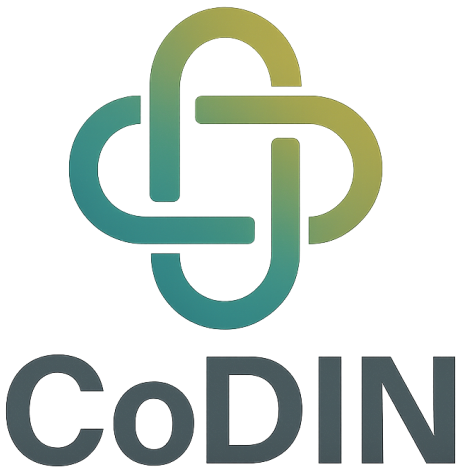

::: {.hero}
::: {.hero-copy}
## Knowledge carried with CARE

CoDIN Press publishes accessible, multilingual and ethically grounded works for readers, practitioners, communities and researchers. Our publications are designed to preserve context, attribution and cultural responsibility as knowledge moves between people, formats and languages.

[Explore publications](publications/){.btn .btn-primary .btn-lg} [About CoDIN Press](about/){.btn .btn-outline-primary .btn-lg}
:::

::: {.hero-mark}
{fig-alt="Interlocking CoDIN institutional mark"}
:::
:::

## Featured publication

::: {.featured-publication}
::: {.featured-cover}
[{fig-alt="Cover of Documenting Performing Arts: A Field Manual"}](publications/documenting-performing-arts/)
:::

::: {.featured-copy}
### Documenting Performing Arts: A Field Manual

### நிகழ்த்துக் கலைகளை ஆவணப்படுத்துதல் — ஓர் களக்கையேடு

A bilingual field manual for documenting performing arts as living knowledge, grounded in relationships, consent, cultural authority and responsible practice.

**English · தமிழ்**  
**Book · Open digital edition · 2026**

[View publication](/dpfa-manual/){.btn .btn-primary} [Read in English](/dpfa-manual/en/){.btn .btn-outline-primary} [தமிழில் வாசிக்க](/dpfa-manual/ta/){.btn .btn-outline-primary lang="ta"}
:::
:::

## Browse the collection

::: {.browse-grid}
::: {.browse-card}
### [Books](books/)

Monographs, manuals and multilingual digital books.
:::

::: {.browse-card}
### [Journals](journals/)

Journal volumes, issues and individual articles.
:::

::: {.browse-card}
### [Resources](resources/)

Reports, field guides, learning materials and other publications.
:::
:::
