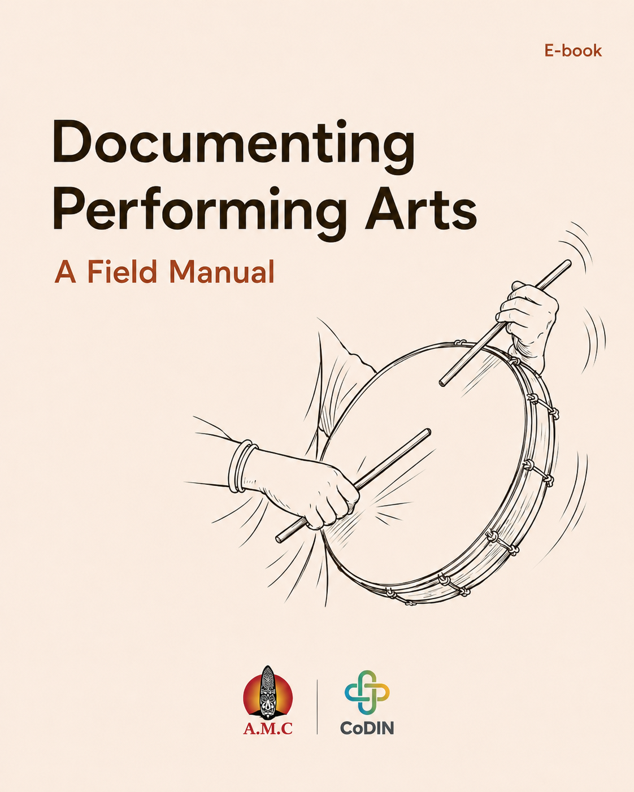

::: {.publication-detail}
::: {.publication-cover}
{fig-alt="Cover of Documenting Performing Arts: A Field Manual"}
:::

::: {.publication-summary}
## Documenting Performing Arts {.unnumbered}

### A Field Manual {.unnumbered}

## நிகழ்த்துக் கலைகளை ஆவணப்படுத்துதல் {.unnumbered}

### ஓர் களக்கையேடு {.unnumbered}

Performing arts are living forms of knowledge expressed through people, relationships, materials, memories and places. This field manual supports documentation grounded in consent, cultural authority, responsible relationships and meaningful return.

::: {.language-actions}
[Read in English](/dpfa-manual/en/){.btn .btn-primary .btn-lg} [தமிழில் வாசிக்க](/dpfa-manual/ta/){.btn .btn-primary .btn-lg}
:::
:::
:::

## Download

| Edition | EPUB | PDF |
|---|---|---|
| English | [Download EPUB](/dpfa-manual/downloads/documenting-performing-arts-en.epub) | [Download PDF](/dpfa-manual/downloads/documenting-performing-arts-en.pdf) |
| தமிழ் | [EPUB பதிவிறக்கம்](/dpfa-manual/downloads/documenting-performing-arts-ta.epub) | [PDF பதிவிறக்கம்](/dpfa-manual/downloads/documenting-performing-arts-ta.pdf) |

All downloadable editions are DRM-free.

## Editors

B. Appu · S. Vijayakumari · R. Gayathri · V. S. Dhivya Bharathi · Karthick Narayanan · R. Kaleeswaran · A. R. D. Prasad

## Publication information

- **E-Version Publisher:** Council for Diversity and Innovation (CoDIN)
- **Web Rendering:** Ritesh Kumar
- **Edition:** First e-version, 2026
- **Languages:** English and Tamil
- **Licence:** [Creative Commons Attribution–NonCommercial–ShareAlike 4.0 International](https://creativecommons.org/licenses/by-nc-sa/4.0/)
- **Source:** [CoDIN-Press/dpfa-manual](https://github.com/CoDIN-Press/dpfa-manual)

### Identifiers

| Edition | ISBN | DOI |
|---|---|---|
| English EPUB | Not yet assigned | Not yet assigned |
| English PDF | Not yet assigned | Not yet assigned |
| Tamil EPUB | Not yet assigned | Not yet assigned |
| Tamil PDF | Not yet assigned | Not yet assigned |

Photographs, illustrations, archival materials and other third-party content may carry separate copyright, cultural, consent or access conditions. Where indicated, those conditions take precedence over the licence applied to the editorial work.
